# Overview

This project constitutes a proof of concept (POC) for some of the work I've been doing over the past few years, in particular in data integration. It covers data ingestion, processing, entity resolution, and creation of gold records.
In general, it follows the medallion architecture, where raw (bronze) data is uploaded into S3 (Minio in this case), and downstream jobs are triggered (manually for now, but later via Airflow sensors).
These tasks include:

1. processing and archiving raw data (bronze) into validated data (silver)
2. loading processed data into a delta table (for automated data versioning)
3. deduplicating data
4. performing entity resolution
5. creating integrated data profiles
6. deduplicating integrated data profiles
7. creating business-oriented records (gold)

I used 3 types of **synthetic** data in this project, all of which have typical errors: duplicated data, data typing issues, null values, etc. All these datasets have some intersecting fields and some IDs, but we mostly depend on company names and geolocation as this is a very typical real-world scenario.  

- [Overview](#overview)
    - [Context](#context)
    - [Data schema](#data-schema)
    - [Core technologies & methodologies](#core-technologies--methodologies)
- [Setup](#setup)
- [Workflow](#data-integration-worfklow)
    1. [Raw/bronze data ingestion](#1-rawbronze-data-ingestion)
    2. [Raw data processing](#2-raw-data-processing)
    3. [Delta tables auditing](#3-delta-tables-auditing)
    4. [Silver data deduplication](#4-silver-data-deduplication)
    5. [Entity resolution - deduplication and linking](#5-entity-resolution---deduplication-and-linking)
    6. [Entity resolution result processing](#6-entity-resolution-result-processing)
    7. [Integrated records deduplication](#7-integrated-records-deduplication)
    8. [Business-layer/gold records generation](#8-business-layergold-records-generation)
-   [Future TODO](#todo)

## Context

The organization operates with a centralized Federal Business Registry which serves as the legal source of truth. However, due to administrative latency, the Federal Business Registry often lags behind real-world changes. To compensate, data is ingested from two specialized departmental registries: the Sub-contractor Registry  and the Sector-Specific Licensing Registry .


|Registry                       |Authority Level|Update Frequency|Primary Data Focus                                              |
|-------------------------------|---------------|----------------|----------------------------------------------------------------|
|Federal Business Registry |Primary (Legal)|Quarterly       |Legal entity names, tax IDs, registered addresses.              |
|Sub-contractor Registry   |Secondary      |Weekly          |Operational status, current project sites, insurance validity.  |
|Licensing Registry        |Tertiary       |On-demand       |Professional certifications, safety ratings, compliance history.|


### Data schema

Below you can find a few data points from each dataset.


##### Businesss registry

|Entity UEI|Official Business Name      |Address Line 1    |City Name|Zip Code|Registration Status|
|----------|----------------------------|------------------|---------|--------|-------------------|
|UEI_5560  |GLOBAL LOGISTICS CORP       |202 CARGO RD      |MIAMI    |33101   |INACTIVE           |
|UEI_4432  |Northwest Piping & Utilities|456 WATER WAY     |         |98101   |ACT                |
|UEI_1100  |midwest masonry corp        |789 BRICK RD      |CHICAGO  |60601   |EXP                |
|UEI_5567  |SUNBELT ROOFING INC         |55 SOLAR BLVD     |PHOENIX  |85001   |                   |
|UEI_2289  |METRO STEEL FABRICATORS     |88 INDUSTRIAL PKWY|NEWARK   |7101    |ACT                |
|UEI_6643  |COASTAL CONCRTE PARTNERS    |12 SHORE DR       | MIAMI   |33101   |ACT                |

##### Licenses registry

|LICENSE_NUM                    |COMPANY NAME   |HQ LOCATION|NAICS CODE                                                      |CERT_EXPIRY_DATE|
|-------------------------------|---------------|-----------|----------------------------------------------------------------|----------------|
|ST-550                         |GLOBAL LOGISTICS|202 CARGO ROAD, MIAMI|484110                                                          |2026-05-22      |
|ST-550                         |GLOBAL LOGISTICS|202 CARGO ROAD, MIAMI|484110                                                          |2026-05-22      |
|ST-442                         |northwest piping & mechanical|456 WATER WAY, Boston|238220                                                          |06/15/25        |
|ST-992                         |ELITE ELEC SYSTEMS|123 Power Av, MIAMI|238210                                                          |2026-12-31      |
|ST-551                         |SUNBELT ROOFING Limited|55 SOLAR BLVD, SEATTLE|23816                                                           |2027-01-01      |
|ST-221                         |METRO STEEL FABRICATORS|88 INDUSTRIAL PARKWAY, New York|238120                                                          |2025-09-30      |


##### Sub-contractors registry

|Vendor ID|Firm Name                   |Vendor UEI        |Certification Type|Trade Specialty|
|---------|----------------------------|------------------|------------------|---------------|
|MIA-5560 |Global Logistics Corp.      |UEI_5560          |MBE               |Freight        |
|SEA-4432 |North West Piping           |UEI_4432          |DBE               |Plumbing, Utilities|
|CHI-1199 |Mid-West Masonry            |                  |WBE               |Brick, Masonry |
|PHX-5501 |Sunbelt Roofing             |                  |MBE               |Commercial Roofing|
|NWK-2289 |Metro Steel Fab             |UEI_2289          |MBE               |Structural Steel|
|MIA-6603 |Coastal Concrete            |                  |DBE               |Foundations, Paving|


### Core technologies & methodologies

#### Data Processing & Storage
- PyArrow: Data serialization and in-memory processing
- Delta Lake: Versioned data storage with ACID transactions
- DuckDB: SQL query engine for analytical processing
- Polars: DataFrame operations for ETL
- Boto3/S3FS: S3 object storage interactions

#### Data Quality & Auditing
- Pydantic: Data model validation and schema enforcement
- Great Expectations: Data quality auditing and reporting

#### Entity Resolution
- Splink: Probabilistic entity resolution and deduplication
- RapidFuzz: Fuzzy string matching for record comparison

#### Data enrichment and features extraction
- CleanCo: Company name standardization
- USAddress/Scourgify: Address parsing and normalization
-  DateParser: Date field normalization

#### Orchestration & DevOps
- Docker: Containerization for local development
- MinIO: Local S3-compatible storage for testing
- Airflow: Orchestration framework (not fully implemented)
- UV: Python environment management
- Ruff: Code formatting and linting

#### Project Logic & Integration
- Medallion Architecture: The organizational framework (Bronze/Silver/Gold) for data refinement.
- Survivorship Rules: Custom logic (implemented in IntegratedRecord) to select the best data points from clustered records.
- ID Bridge Table: A mapping strategy used to maintain lineage between transient entity clusters and their source systems.


# Setup 

Setup can be done via make commands.

- Start necessary Docker containers (Minio) with:
```bash
make infra_up
```

- Stop Docker containers (Minio and Postgres) with:
```bash
make infra_down
```

- Check Docker containers status (Minio and Postgres) with:
```bash
make infra_status
```


## Local Python environment

This repo uses [`uv`](https://github.com/astral-sh/uv) to manage the Python environment.

Install uv with :

```bash
curl -LsSf https://astral.sh/uv/install.sh | sh
```

- Create/update the environment:
```bash
make install
```

- Activate the environment (also sources `.env`):
```bash
make activate
```

- Run tests:
```bash
make test
```

- Format/lint:
```bash
make format
```


# Data integration workflow

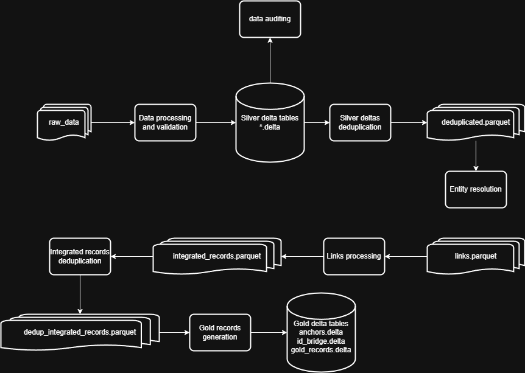


You can run the full pipeline with:
```bash
dip pipeline
```

Although, **I'd suggest you run each step individually so you can better understand the workflow.**


## 1. Raw/bronze data ingestion

Upload test data to S3 bucket (default: `data`) in the `bronze` area:

```bash
dip upload-bronze
```

This will upload all the files in `tests/data/` to Minio, e.g., `bronze/business_entity_registry/business_entity_registry.csv`

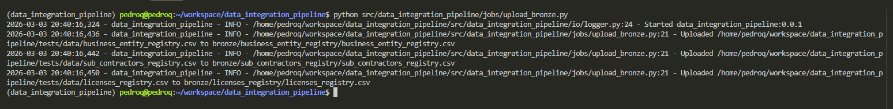

I'm using MinIO as a local S3 storage, where I will host the data, including the raw csv files and all downstream generated delta tables and parquet files. 


## 2. Raw data processing

Process bronze data S3 bucket `data` and write to S3 bucket `data` in `silver` folder:

```bash
dip process-bronze
```

Note that data is read and written into S3 directly without landing into a local folder. Depending on the requirements and workflow bottleneck, this could change, and we could first download to local, e.g., if we want to distribute a file into batches of data and process those in parallel. As with everything, it depends on the business context.

This will process all the data in the bronze layer, and write them to a per-data source delta table, e.g., `data/silver/business_entity_registry/records.delta`. This allows us to track over-time changes in data, and potentially rollback to specific versions or timestamps. Note that the delta tables are split by partition keys, which are defined in the respective data model, e.g., `src/data_integration_pipeline/core/data_processing/data_models/data_sources/business_entity_registry.py`. For example for business entity registries, we set the partition key to the field `city` meaning that the data table is split according to the city, if the field is empty, it's instead assigned to the `UNKNOWN` partition.

Note that: 

- invalid rows are archived in `errors/processing/`, e.g., `errors/processing/business_entity_registry/errors.parquet` 
- bronze/raw data is archived in `archive/`


Console output:
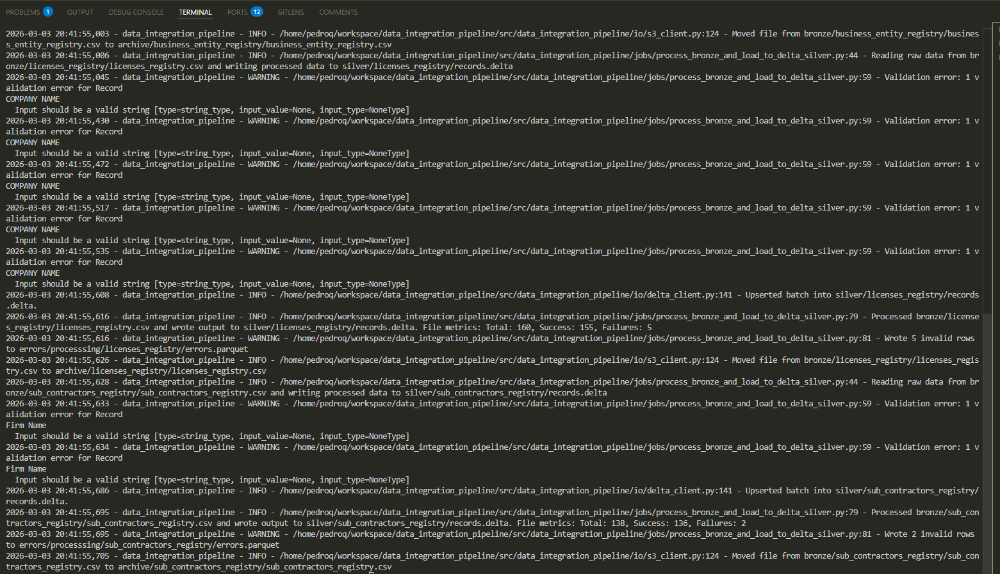

Minio storage:
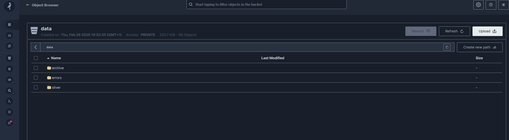

Delta table:
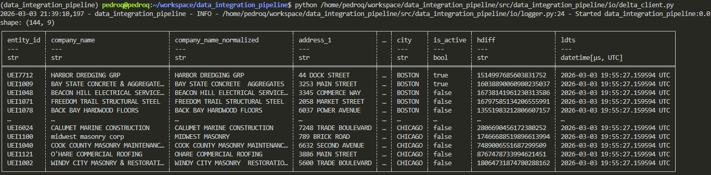

The goal of using delta tables here is to be able to capture data changes over time, e.g., if one of the fields in the data were to change, you would be able to see the commit version of the data, and also be able to roll back to specific versions/timestamps.
For example, below I changed one of the values of the raw data and after re-processing it, you can see the data history for this specific table:

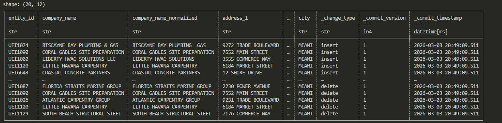


## 3. Delta tables auditing

Run data auditing on the delta tables:

```bash
dip audit-silver
```

You can check the results by running:
```bash
make audit_docs
```

This will launch a local server exposing the HTML documents generated by [Great Expectations (GX)](https://greatexpectations.io/), which you can check by going [http://localhost:8080/](here)

This will launch a local server exposing the HTML documents generated by [Great Expectations (GX)](https://greatexpectations.io/), which you can check by going [here](http://localhost:8080/).

Below you can see how reports look in GX. Note that I've set fairly basic auditing, but you can see how easy to use it is, especially when you combine it with multiple data stages (e.g., raw->validated).

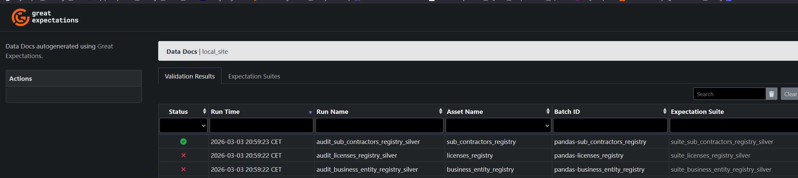

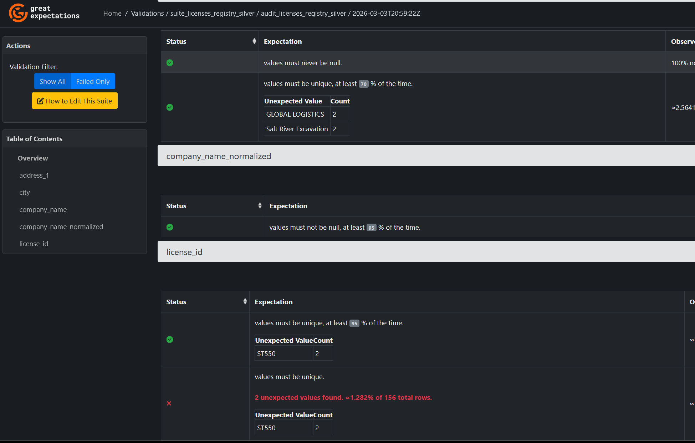


## 4. Silver data deduplication

Deduplicate silver data based on each of the data models' primary key:

```bash
dip dedup-silver
```

In this step, the goal is to remove data duplicates, which are detected by detecting records with the same primary key (which depends on the underlying data source and respective data model). The elimitation of duplicates is based on the 1. whether the record is active (if info is available) and 2.0 the fill count of each flat record. We could also modify the data model to include a `global_score` based on other metrics. See `DuplicatesProcessor._deduplicate_silver` for more information. This step is "*optional*", but **recommended if the primary keys are strong indicators of data redundancy**.

Note that this step takes a snapshot of the last state of the delta table and creates a deduplicated data, which is then fed into downstream steps. For example the deduplicated data of `data/silver/business_entity_registry/records.delta` is stored as `data/silver/business_entity_registry/deduplicated.parquet`

You can see for example that the licenses registry had a duplicate record:

|LICENSE_NUM                    |COMPANY NAME   |HQ LOCATION|NAICS CODE                                                      |CERT_EXPIRY_DATE|
|-------------------------------|---------------|-----------|----------------------------------------------------------------|----------------|
|ST-550                         |GLOBAL LOGISTICS|202 CARGO ROAD, MIAMI|484110                                                          |2026-05-22      |
|ST-550                         |GLOBAL LOGISTICS|202 CARGO ROAD, MIAMI|484110                                                          |2026-05-22      |

Where one of them is removed:

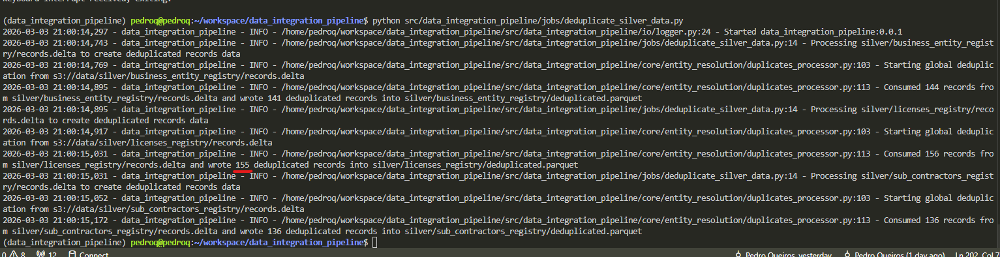


## 5. Entity resolution - deduplication and linking

Run entity resolution via Splink with deduplication and linking on the `deduplicated.parquet` files. 

```bash
dip run-er
```

This will assign each record to a cluster, which we process in the next step.

Note that this step is at the moment quite rudimentary, since Splink depends on training/pre-trained expectation-maximization models, and performing entity resolution with small datasets is not quite feasible. For example, for the current data, we achieved this overlap:

```
business_entity_registry: 100
business_entity_registry + licenses_registry: 32
business_entity_registry + licenses_registry + sub_contractors_registry: 3
business_entity_registry + sub_contractors_registry: 6
licenses_registry: 120
sub_contractors_registry: 127
```

This is not significant and not representative of real entity resolution, but since the data is synthetically generated (and very small), results are subpar.


Note that entity resolution can be run multiple times, where each run is associated with a different hash key e.g., `data/entity_resolution/019cb3cc-a219-7f16-b8fd-f88d5bebb883`. **In the next steps, if multiple runs are found, we always take the run with the latest timestamp**

Note that we store this information per run:
- `model.json` represents the Splink model
- `metadata.json` contains run metadata, e.g.,
```python
{'run_id': '019cb3d0-c21a-7560-afca-9f5ecc0d36b1', 'links_s3_path': 'entity_resolution/019cb3d0-c21a-7560-afca-9f5ecc0d36b1/links.parquet', 'timestamp': '2026-03-03T13:08:49.692596+00:00', 'execution_context': {'data_integration_pipeline_version': '0.0.1', 'python_version': '3.11.14', 'splink_version': '4.0.15'}, 'inputs': {'table_names': ['business_entity_registry', 'licenses_registry', 'sub_contractors_registry'], 'per_source_records_count': {'business_entity_registry': 141, 'licenses_registry': 155, 'sub_contractors_registry': 136}, 'records_count': 432}, 'outputs': {'links_count': (432,), 'clusters_count': 387}, 'model_metadata': {'splink_inference_predict_threshold': 0.01, 'splink_clustering_threshold': 0.9, 'settings_hash': '5f2fc7d557f9c29f7cfcaccc7b102758'}, 'overlap_report': {'business_entity_registry': 99, 'business_entity_registry + licenses_registry': 33, 'business_entity_registry + licenses_registry + sub_contractors_registry': 3, 'business_entity_registry + sub_contractors_registry': 6, 'licenses_registry': 119, 'sub_contractors_registry': 127}}
```
- `links.parquet` contains the actual links (i.e., clusters) found by Splink

Besides the aforementioned points, there are 2 things we could improve upon:

- version and store Splink models in Mlflow
- expose links lineage and metadata for better entity resolution auditing

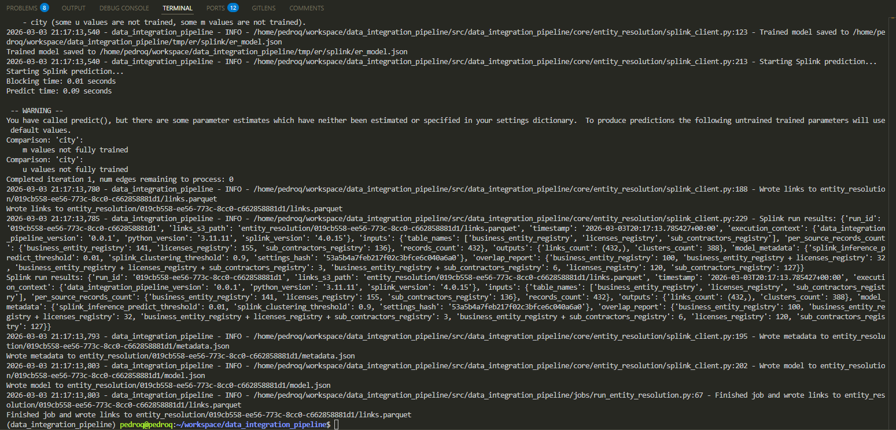

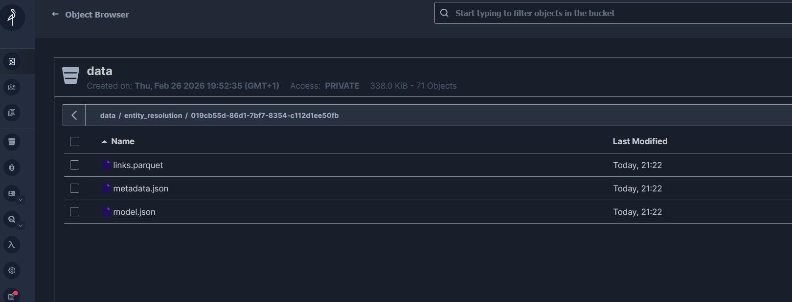


## 6. Entity resolution result processing

Process Splink links:

```bash
dip create-integrated
```


The next step processes all clusters formed by Splink and creates "integrated" records, where we:
    1. Evaluate each record according to record depth and record consensus with other records
    2. Per list of records define an anchor record (highest score record from `business_entity_registry` or `sub_contractors_registry`)
    3. Define an anchor record (which will represent the integrated record) and alternative entities, i.e., other records within the same cluster.
    4. Apply survivorship rules to fill out the integrated record data model (which at the moment are rather rudimentary but could be easily improved upon)


For more information check `src/data_integration_pipeline/core/entity_resolution/integrated_record.py` and in particular the `from_cluster` function

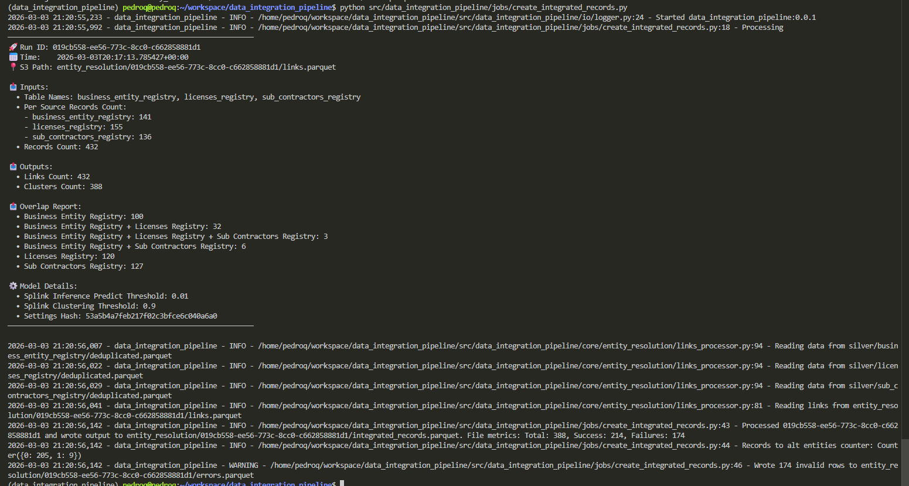

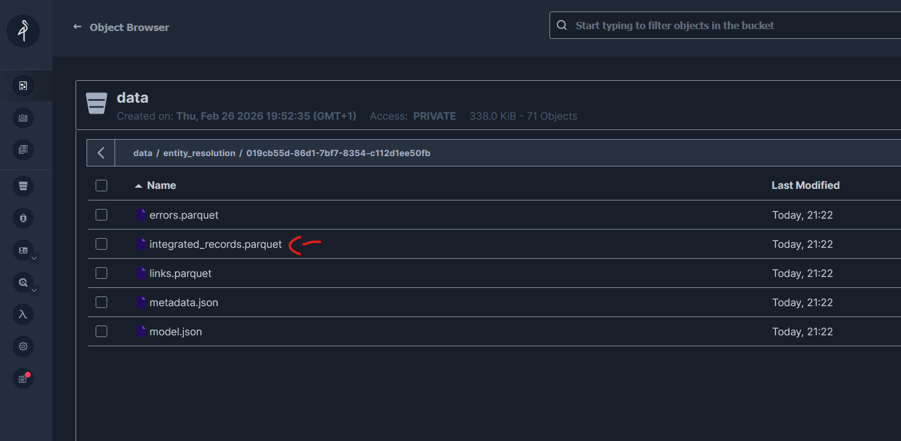


## 7. Integrated records deduplication

After generating the integrated records, we run another deduplication step, where we deduplicate the records based on their primary key and data source. Here we the fields `is_active` and `global_score` (this score is generated in the integrated record pydantic data model) to rank duplicate records

```bash
dip dedup-integrated
```

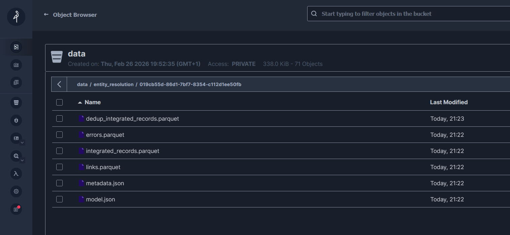


## 8. Business-layer/gold records generation

The last step is to create the gold records which represent the entities which are consumed by downstream business-oriented stakeholders.

```bash
dip create-gold
```

This is done by:
1. Getting all the anchor integrated records and storing them in `anchors.parquet` file
2. Each alternative entity in the integrated records is then linked to the anchor `id_bridge.file`
3. We create a table with each anchor and alternative entity as rows. Ideally this step would actually just be a materialization of the link between anchors and the id bridge, but since we are working with a local duckdb instance, we materialize the data instead. Nonetheless, the data architecture for this is there, the rest is just "setup"

Note that the entities here are transient, i.e., if entity resolution is done again, the clusters might change. This is generally not desirable in a production environment when you need to have a permanent record, however that is also why we kept the id_bridge table, so that these transient entities are properly traced back to the source. In any case, implementation specifics ultimately depend on the business and how downstream data is used. In any case, once records are linked, downstream gold records can be generated via multiple methods.


Console output:

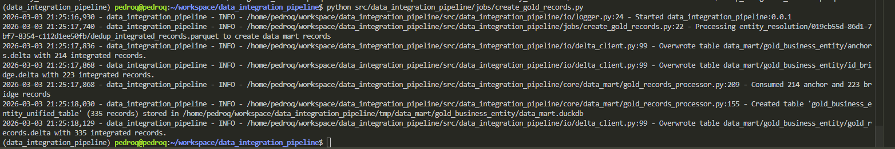

Gold records delta table:

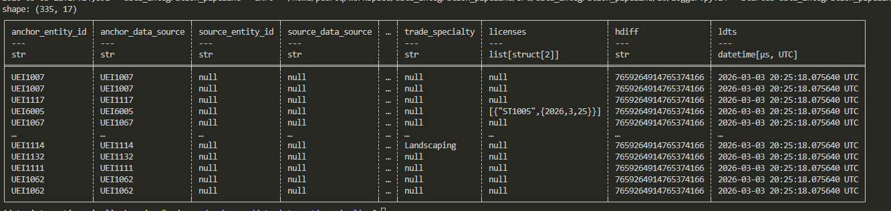

Minio:
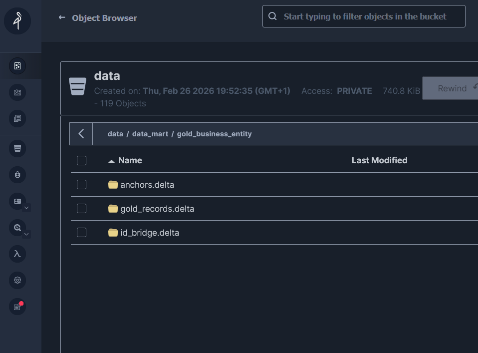


# TODO
- add unit testing
- add airflow sensors and respective orchestration. I've already started (see `dags`), but will need a few more days to wrap that up
- Improve entity resolution : add better auditing for splink matches, model logging (Mlflow) and better Splink settings. This is the weakest point of this POC, but also natural due to the nature of the input data.
- The IO objects don't have a well standardized protocol, so it ought to be improved. I'm using delta-scan in duckdb but then also have clients for each. This needs to be better standardized
- Add more metrics, auditing, etc. At the moment we only really have logs, but this could be substantially improved. I could also add a dashboard later.
- The pydantic data models schema and data model is redundant for integrated and gold records, and we need a better way to handle it
- Add parallelism, a good option would be to batch the data and let tasks run independently. This would pair very easily with airflow. During ingestion and processing it would be rather straightforward, however, before entity resolution, we would just need to make sure all tasks are finished so that we compile the full data for matching.
